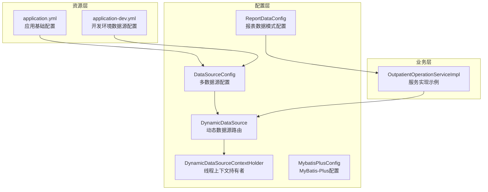
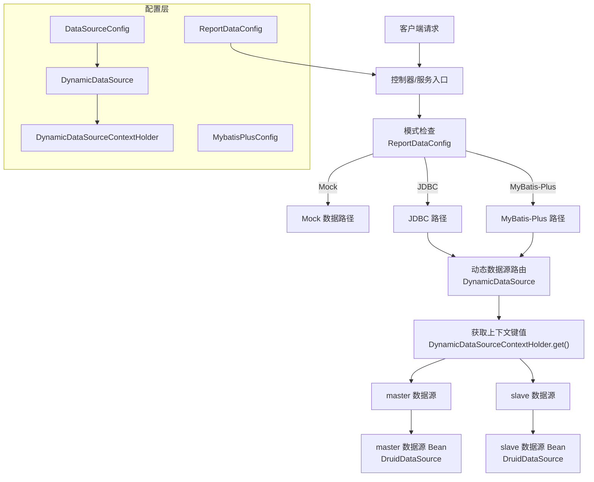
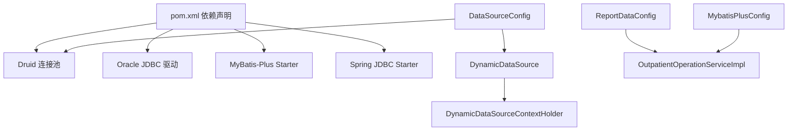

# 数据源配置

<cite>
**本文档引用的文件**
- [DataSourceConfig.java](file://src/main/java/com/reports/config/DataSourceConfig.java)
- [DynamicDataSource.java](file://src/main/java/com/reports/config/DynamicDataSource.java)
- [DynamicDataSourceContextHolder.java](file://src/main/java/com/reports/config/DynamicDataSourceContextHolder.java)
- [application.yml](file://src/main/resources/application.yml)
- [application-dev.yml](file://src/main/resources/application-dev.yml)
- [MybatisPlusConfig.java](file://src/main/java/com/reports/config/MybatisPlusConfig.java)
- [ReportDataConfig.java](file://src/main/java/com/reports/config/ReportDataConfig.java)
- [OutpatientOperationServiceImpl.java](file://src/main/java/com/reports/service/impl/OutpatientOperationServiceImpl.java)
- [pom.xml](file://pom.xml)
</cite>

## 目录
1. [简介](#简介)
2. [项目结构](#项目结构)
3. [核心组件](#核心组件)
4. [架构总览](#架构总览)
5. [详细组件分析](#详细组件分析)
6. [依赖关系分析](#依赖关系分析)
7. [性能考虑](#性能考虑)
8. [故障排查指南](#故障排查指南)
9. [最佳实践](#最佳实践)
10. [结论](#结论)

## 简介
本文件面向数据源配置与动态数据源切换的实现与使用，重点覆盖以下内容：
- DataSourceConfig 中数据库连接配置，包括连接池参数、数据库驱动、连接URL、用户名密码等设置
- DynamicDataSource 动态数据源切换机制的实现原理和配置方法
- DynamicDataSourceContextHolder 线程上下文持有者的作用和使用方式
- 不同数据源模式的配置差异和切换条件
- 数据源配置的最佳实践和性能优化建议
- 连接池监控和故障排查的方法

## 项目结构
该模块采用 Spring Boot 的配置化方式组织数据源相关代码，主要文件分布如下：
- 配置层：DataSourceConfig、DynamicDataSource、DynamicDataSourceContextHolder、MybatisPlusConfig、ReportDataConfig
- 资源层：application.yml、application-dev.yml
- 业务层：OutpatientOperationServiceImpl 展示了数据源模式切换与动态数据源的使用示例

图表来源
- [DataSourceConfig.java:1-56](file://src/main/java/com/reports/config/DataSourceConfig.java#L1-L56)
- [DynamicDataSource.java:1-16](file://src/main/java/com/reports/config/DynamicDataSource.java#L1-L16)
- [DynamicDataSourceContextHolder.java:1-38](file://src/main/java/com/reports/config/DynamicDataSourceContextHolder.java#L1-L38)
- [MybatisPlusConfig.java:1-28](file://src/main/java/com/reports/config/MybatisPlusConfig.java#L1-L28)
- [ReportDataConfig.java:1-45](file://src/main/java/com/reports/config/ReportDataConfig.java#L1-L45)
- [application.yml:1-32](file://src/main/resources/application.yml#L1-L32)
- [application-dev.yml:1-45](file://src/main/resources/application-dev.yml#L1-L45)
- [OutpatientOperationServiceImpl.java:1-253](file://src/main/java/com/reports/service/impl/OutpatientOperationServiceImpl.java#L1-L253)

章节来源
- [DataSourceConfig.java:1-56](file://src/main/java/com/reports/config/DataSourceConfig.java#L1-L56)
- [application.yml:1-32](file://src/main/resources/application.yml#L1-L32)
- [application-dev.yml:1-45](file://src/main/resources/application-dev.yml#L1-L45)

## 核心组件
本节对数据源相关的核心组件进行深入解析，涵盖职责、配置项、关键方法及使用要点。

- DataSourceConfig：负责定义主从数据源 Bean，并装配为动态数据源的目标映射，同时设置默认数据源为 master。
- DynamicDataSource：继承 Spring 的 AbstractRoutingDataSource，重写 determineCurrentLookupKey 方法，从线程上下文获取当前数据源键值。
- DynamicDataSourceContextHolder：线程本地存储的数据源上下文，提供 set/get/clear 方法，默认数据源为 master。
- ReportDataConfig：控制报表查询模式（mock/jdbc/mybatis-plus），用于决定业务层如何选择数据访问路径。
- MybatisPlusConfig：MyBatis-Plus 分页插件配置，支持 Oracle 数据库类型。

章节来源
- [DataSourceConfig.java:14-56](file://src/main/java/com/reports/config/DataSourceConfig.java#L14-L56)
- [DynamicDataSource.java:5-16](file://src/main/java/com/reports/config/DynamicDataSource.java#L5-L16)
- [DynamicDataSourceContextHolder.java:3-38](file://src/main/java/com/reports/config/DynamicDataSourceContextHolder.java#L3-L38)
- [ReportDataConfig.java:8-45](file://src/main/java/com/reports/config/ReportDataConfig.java#L8-L45)
- [MybatisPlusConfig.java:10-28](file://src/main/java/com/reports/config/MybatisPlusConfig.java#L10-L28)

## 架构总览
下图展示了数据源配置与动态切换的整体架构，以及与业务层的交互关系。

图表来源
- [DataSourceConfig.java:18-53](file://src/main/java/com/reports/config/DataSourceConfig.java#L18-L53)
- [DynamicDataSource.java:8-13](file://src/main/java/com/reports/config/DynamicDataSource.java#L8-L13)
- [DynamicDataSourceContextHolder.java:6-37](file://src/main/java/com/reports/config/DynamicDataSourceContextHolder.java#L6-L37)
- [ReportDataConfig.java:12-44](file://src/main/java/com/reports/config/ReportDataConfig.java#L12-L44)
- [OutpatientOperationServiceImpl.java:47-73](file://src/main/java/com/reports/service/impl/OutpatientOperationServiceImpl.java#L47-L73)

## 详细组件分析

### DataSourceConfig 组件分析
- 职责：定义主数据源（master）和从数据源（slave），并通过动态数据源装配目标数据源映射，设置默认数据源为 master。
- 关键点：
  - 使用 Druid 连接池，通过 @ConfigurationProperties 绑定 spring.datasource.master 和 spring.datasource.slave 前缀的配置。
  - 将 master 和 slave 注册为目标数据源，并设置默认目标为 master。
- 连接池参数位置：在 application-dev.yml 中以 spring.datasource.master 和 spring.datasource.slave 前缀配置。

章节来源
- [DataSourceConfig.java:18-53](file://src/main/java/com/reports/config/DataSourceConfig.java#L18-L53)
- [application-dev.yml:4-38](file://src/main/resources/application-dev.yml#L4-L38)

### DynamicDataSource 组件分析
- 职责：作为 Spring 的路由数据源，根据当前线程上下文返回对应的数据源。
- 关键点：
  - 重写 determineCurrentLookupKey，返回 DynamicDataSourceContextHolder.get()。
  - 未匹配时使用默认目标数据源（master）。
- 使用场景：在需要按请求或事务切换读写分离时，结合线程上下文进行切换。

章节来源
- [DynamicDataSource.java:8-13](file://src/main/java/com/reports/config/DynamicDataSource.java#L8-L13)

### DynamicDataSourceContextHolder 组件分析
- 职责：线程本地存储当前数据源键值，提供 set/get/clear 方法。
- 关键点：
  - 默认数据源常量 DEFAULT_DS 为 "master"。
  - get() 方法在空值时回退到默认数据源。
  - clear() 方法移除当前线程的上下文，避免线程复用导致的数据源污染。
- 使用方式：在业务逻辑中调用 set("slave") 切换到从库，执行完毕后调用 clear() 清理。

章节来源
- [DynamicDataSourceContextHolder.java:6-37](file://src/main/java/com/reports/config/DynamicDataSourceContextHolder.java#L6-L37)

### ReportDataConfig 组件分析
- 职责：控制报表查询模式，支持 mock、jdbc、mybatis-plus 三种模式。
- 关键点：
  - 通过 reports.data.mode 配置项控制模式。
  - 提供 isMock()/isJdbc()/isMybatisPlus() 辅助判断。
- 与数据源的关系：当模式为 jdbc 或 mybatis-plus 时，通常会使用动态数据源；当模式为 mock 时，不涉及真实数据库。

章节来源
- [ReportDataConfig.java:12-44](file://src/main/java/com/reports/config/ReportDataConfig.java#L12-L44)
- [application.yml:21-23](file://src/main/resources/application.yml#L21-L23)

### MybatisPlusConfig 组件分析
- 职责：配置 MyBatis-Plus 分页插件，指定数据库类型为 Oracle，并启用日志与下划线转驼峰映射。
- 关键点：
  - 分页插件使用 PaginationInnerInterceptor，DbType 指定 ORACLE。
  - Mapper 扫描路径为 classpath*:/mapper/**/*.xml。
- 与数据源的关系：MyBatis-Plus 通过 Spring 管理的数据源进行数据库访问，可与动态数据源配合使用。

章节来源
- [MybatisPlusConfig.java:13-27](file://src/main/java/com/reports/config/MybatisPlusConfig.java#L13-L27)
- [application-dev.yml:40-44](file://src/main/resources/application-dev.yml#L40-L44)

### 应用配置文件分析
- application.yml：定义应用端口、活动 profile、追踪号规则、报表数据模式（默认 mock）等。
- application-dev.yml：定义主从数据源的连接信息（驱动、URL、用户名、密码）以及 Druid 连接池参数（初始大小、最小空闲、最大活跃、等待超时、空闲回收周期、最小空闲时间、校验查询、空闲检测开关等）。

章节来源
- [application.yml:1-32](file://src/main/resources/application.yml#L1-L32)
- [application-dev.yml:1-45](file://src/main/resources/application-dev.yml#L1-L45)

### 业务层使用示例分析
- OutpatientOperationServiceImpl：演示了三种数据模式的分支处理，以及在 JDBC 模式下如何通过 DynamicDataSourceContextHolder 切换数据源（注释中展示 set("slave") 与 clear() 的使用）。
- 关键流程：
  - 读取 ReportDataConfig 决定模式。
  - 在 JDBC 模式下，可在执行查询前设置数据源键值，在查询后清理上下文。
  - 异常时回退到 Mock 数据，保证系统可用性。

章节来源
- [OutpatientOperationServiceImpl.java:47-73](file://src/main/java/com/reports/service/impl/OutpatientOperationServiceImpl.java#L47-L73)
- [OutpatientOperationServiceImpl.java:152-177](file://src/main/java/com/reports/service/impl/OutpatientOperationServiceImpl.java#L152-L177)
- [OutpatientOperationServiceImpl.java:179-212](file://src/main/java/com/reports/service/impl/OutpatientOperationServiceImpl.java#L179-L212)

## 依赖关系分析
- Maven 依赖：项目引入了 Druid 连接池、Oracle JDBC 驱动、MyBatis-Plus Starter、Spring JDBC Starter 等，确保数据源与 ORM 能力的完整支持。
- 组件耦合：
  - DataSourceConfig 依赖 DruidDataSource 与 Spring 配置绑定能力。
  - DynamicDataSource 依赖 Spring 的 AbstractRoutingDataSource 与线程上下文。
  - ReportDataConfig 与业务层解耦，通过配置驱动行为。
  - MybatisPlusConfig 与数据源解耦，通过 Spring 容器注入。

图表来源
- [pom.xml:26-98](file://pom.xml#L26-L98)
- [DataSourceConfig.java:3-26](file://src/main/java/com/reports/config/DataSourceConfig.java#L3-L26)
- [DynamicDataSource.java:3-8](file://src/main/java/com/reports/config/DynamicDataSource.java#L3-L8)
- [DynamicDataSourceContextHolder.java:6-37](file://src/main/java/com/reports/config/DynamicDataSourceContextHolder.java#L6-L37)
- [ReportDataConfig.java:12-44](file://src/main/java/com/reports/config/ReportDataConfig.java#L12-L44)
- [MybatisPlusConfig.java:13-27](file://src/main/java/com/reports/config/MybatisPlusConfig.java#L13-L27)
- [OutpatientOperationServiceImpl.java:38-45](file://src/main/java/com/reports/service/impl/OutpatientOperationServiceImpl.java#L38-L45)

章节来源
- [pom.xml:26-98](file://pom.xml#L26-L98)

## 性能考虑
- 连接池参数建议：
  - 初始大小与最小空闲：根据并发请求量设置，避免频繁创建销毁连接。
  - 最大活跃数：限制最大连接数，防止数据库过载。
  - 等待超时：合理设置最大等待时间，避免请求长时间阻塞。
  - 空闲回收周期与最小空闲时间：平衡资源回收与连接复用。
  - 校验查询与空闲检测：开启空闲检测可提升连接健康度，但需权衡性能。
- 读写分离策略：
  - 默认使用 master 数据源，仅在特定查询（如报表统计）时切换到 slave。
  - 切换后及时清理上下文，避免线程复用导致的数据源污染。
- 模式选择：
  - 开发调试阶段可使用 mock 模式，减少数据库压力。
  - 生产环境优先使用 JDBC 或 MyBatis-Plus，结合分页插件提升查询效率。

[本节为通用性能建议，无需具体文件分析]

## 故障排查指南
- 连接池问题：
  - 现象：连接耗尽、超时异常。
  - 排查：检查 initial-size、min-idle、max-active、max-wait 参数是否合理；确认是否存在未清理的上下文导致连接泄漏。
- 数据源切换无效：
  - 现象：查询仍走默认数据源。
  - 排查：确认在执行查询前已 set("slave")，并在查询后调用 clear()；检查 DynamicDataSource 的 targetDataSources 是否正确注册。
- 驱动与 URL 错误：
  - 现象：无法建立连接。
  - 排查：核对 driver-class-name、url、username、password；确保 Oracle 驱动版本与数据库兼容。
- 模式不生效：
  - 现象：报表查询未按预期模式执行。
  - 排查：检查 reports.data.mode 配置项；确认 ReportDataConfig 的 isJdbc()/isMybatisPlus() 判断逻辑与配置一致。

章节来源
- [application-dev.yml:4-38](file://src/main/resources/application-dev.yml#L4-L38)
- [DynamicDataSourceContextHolder.java:18-35](file://src/main/java/com/reports/config/DynamicDataSourceContextHolder.java#L18-L35)
- [OutpatientOperationServiceImpl.java:162-165](file://src/main/java/com/reports/service/impl/OutpatientOperationServiceImpl.java#L162-L165)

## 最佳实践
- 明确的切换边界：
  - 在进入需要切换数据源的业务逻辑前设置上下文，在退出时立即清理，避免跨请求污染。
- 合理的连接池参数：
  - 参考生产环境压测结果调整连接池参数，确保吞吐与延迟平衡。
- 模式化治理：
  - 使用 ReportDataConfig 控制数据访问模式，便于灰度发布与快速回滚。
- 监控与告警：
  - 结合 Druid 的监控页面或 Actuator 暴露的指标，关注连接池活跃数、等待时间、错误率等关键指标。
- 安全与密钥管理：
  - 将数据库凭据放入安全的配置中心或环境变量，避免硬编码在配置文件中。

[本节为通用最佳实践，无需具体文件分析]

## 结论
本文档系统梳理了数据源配置与动态数据源切换的实现与使用方法，明确了 DataSourceConfig、DynamicDataSource、DynamicDataSourceContextHolder、ReportDataConfig、MybatisPlusConfig 等核心组件的职责与协作关系，并提供了基于配置文件的参数说明、业务层使用示例、性能优化建议与故障排查方法。通过规范的上下文切换与合理的连接池参数，可有效支撑报表类系统的高可用与高性能需求。