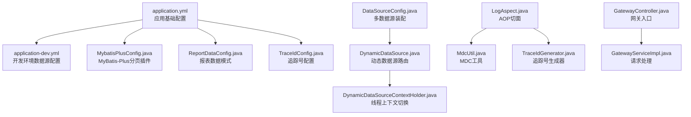
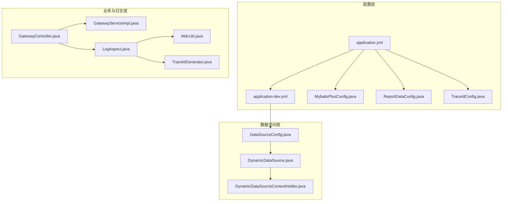
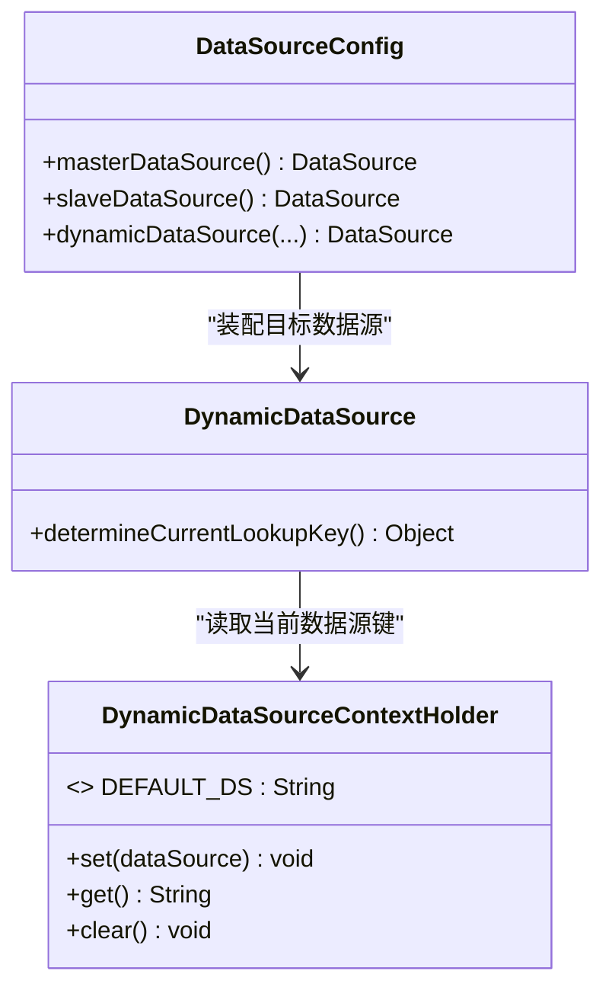
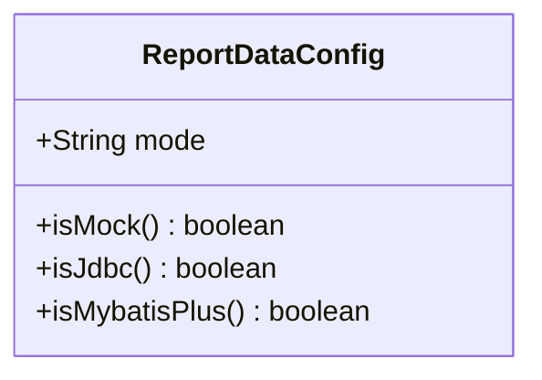
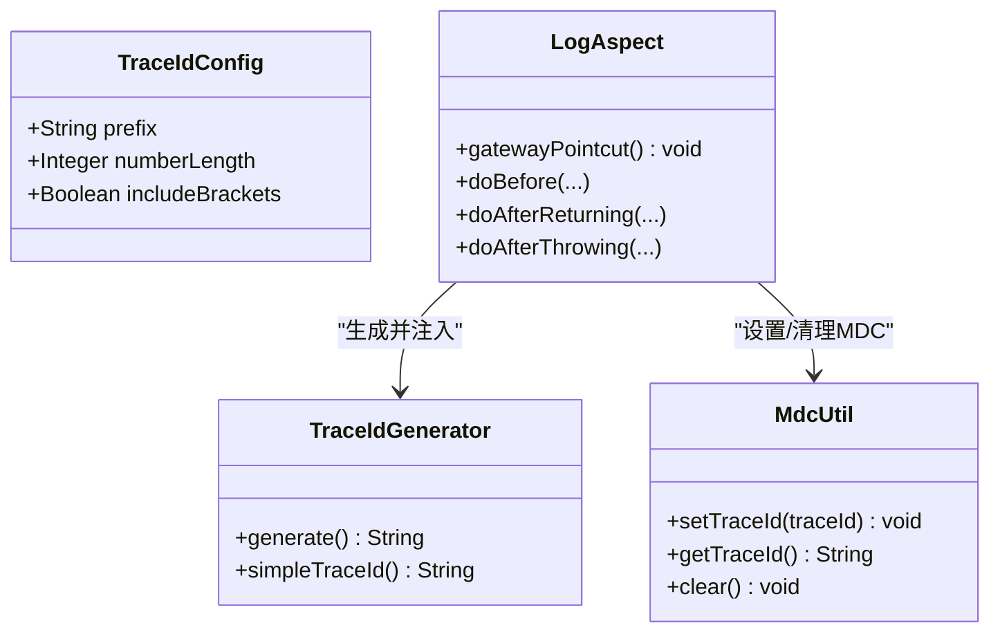
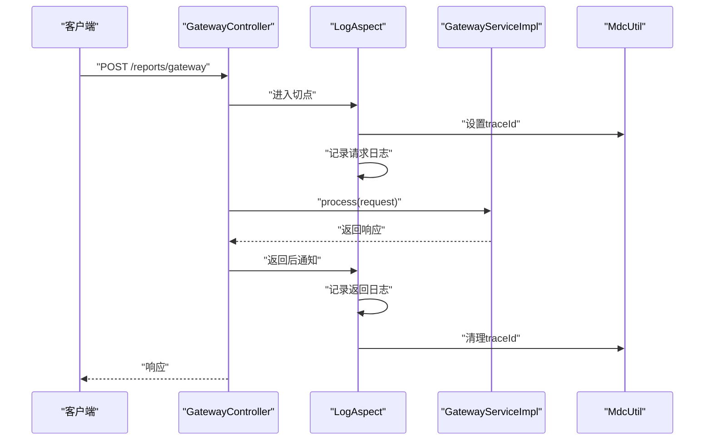
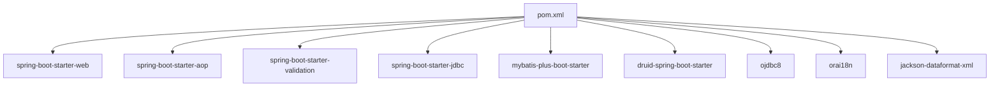

# 配置管理

<cite>
**本文引用的文件**
- [application.yml](file://src/main/resources/application.yml)
- [application-dev.yml](file://src/main/resources/application-dev.yml)
- [DataSourceConfig.java](file://src/main/java/com/reports/config/DataSourceConfig.java)
- [DynamicDataSource.java](file://src/main/java/com/reports/config/DynamicDataSource.java)
- [DynamicDataSourceContextHolder.java](file://src/main/java/com/reports/config/DynamicDataSourceContextHolder.java)
- [MybatisPlusConfig.java](file://src/main/java/com/reports/config/MybatisPlusConfig.java)
- [ReportDataConfig.java](file://src/main/java/com/reports/config/ReportDataConfig.java)
- [TraceIdConfig.java](file://src/main/java/com/reports/config/TraceIdConfig.java)
- [LogAspect.java](file://src/main/java/com/reports/aspect/LogAspect.java)
- [MdcUtil.java](file://src/main/java/com/reports/util/MdcUtil.java)
- [TraceIdGenerator.java](file://src/main/java/com/reports/util/TraceIdGenerator.java)
- [GatewayController.java](file://src/main/java/com/reports/controller/GatewayController.java)
- [GatewayServiceImpl.java](file://src/main/java/com/reports/service/impl/GatewayServiceImpl.java)
- [GatewayService.java](file://src/main/java/com/reports/service/GatewayService.java)
- [pom.xml](file://pom.xml)
</cite>

## 目录
1. [简介](#简介)
2. [项目结构与配置文件总览](#项目结构与配置文件总览)
3. [核心配置组件](#核心配置组件)
4. [架构概览](#架构概览)
5. [详细组件分析](#详细组件分析)
6. [依赖关系分析](#依赖关系分析)
7. [性能与安全配置建议](#性能与安全配置建议)
8. [故障排查指南](#故障排查指南)
9. [结论](#结论)
10. [附录：配置项参考表](#附录配置项参考表)

## 简介
本文件系统化梳理了该报告网关服务的配置管理方案，覆盖数据库连接与动态数据源切换、MyBatis-Plus分页插件、链路追踪与日志、报表数据模式控制、以及AOP切面配置。文档同时给出不同环境下的配置差异、默认值与取值范围、验证方法与常见问题排查步骤，并提供性能与安全优化建议，帮助开发者正确配置与维护应用。

## 项目结构与配置文件总览
- 应用基础配置位于 resources 下的 YAML 文件，按 profile 切换开发与生产环境。
- 核心配置类位于 config 包中，负责装配数据源、MyBatis-Plus、链路追踪配置与报表数据模式。
- AOP 切面位于 aspect 包，通过 LogAspect 对网关控制器进行统一日志与追踪埋点。
- 业务入口为 GatewayController，调用 GatewayServiceImpl 完成请求分发与处理。

图表来源
- [application.yml:1-32](file://src/main/resources/application.yml#L1-L32)
- [application-dev.yml:1-45](file://src/main/resources/application-dev.yml#L1-L45)
- [MybatisPlusConfig.java:1-28](file://src/main/java/com/reports/config/MybatisPlusConfig.java#L1-L28)
- [ReportDataConfig.java:1-45](file://src/main/java/com/reports/config/ReportDataConfig.java#L1-L45)
- [TraceIdConfig.java:1-33](file://src/main/java/com/reports/config/TraceIdConfig.java#L1-L33)
- [DataSourceConfig.java:1-56](file://src/main/java/com/reports/config/DataSourceConfig.java#L1-L56)
- [DynamicDataSource.java:1-16](file://src/main/java/com/reports/config/DynamicDataSource.java#L1-L16)
- [DynamicDataSourceContextHolder.java:1-38](file://src/main/java/com/reports/config/DynamicDataSourceContextHolder.java#L1-L38)
- [LogAspect.java:1-74](file://src/main/java/com/reports/aspect/LogAspect.java#L1-L74)
- [MdcUtil.java:1-34](file://src/main/java/com/reports/util/MdcUtil.java#L1-L34)
- [TraceIdGenerator.java:1-57](file://src/main/java/com/reports/util/TraceIdGenerator.java#L1-L57)
- [GatewayController.java:1-38](file://src/main/java/com/reports/controller/GatewayController.java#L1-L38)
- [GatewayServiceImpl.java:1-51](file://src/main/java/com/reports/service/impl/GatewayServiceImpl.java#L1-L51)

章节来源
- [application.yml:1-32](file://src/main/resources/application.yml#L1-L32)
- [application-dev.yml:1-45](file://src/main/resources/application-dev.yml#L1-L45)

## 核心配置组件
- 数据库连接与动态数据源
  - 通过 DataSourceConfig 装配主从数据源与动态数据源，使用 Druid 连接池。
  - DynamicDataSource 基于 AbstractRoutingDataSource 实现读写分离路由。
  - DynamicDataSourceContextHolder 提供线程级数据源上下文设置与清理。
- MyBatis-Plus
  - 在 MybatisPlusConfig 中注册分页插件，适配 Oracle 数据库方言。
  - 启用 Mapper 扫描与 XML 映射路径。
- 报表数据模式
  - ReportDataConfig 控制报表查询走 Mock、JDBC 或 MyBatis-Plus 模式，默认 mock。
- 追踪号与日志
  - TraceIdConfig 定义追踪号前缀、长度与格式。
  - LogAspect 对 GatewayController 方法织入前置、后置与异常日志，结合 MDC 输出 traceId。
  - TraceIdGenerator 基于配置生成带/不带方括号的追踪号。
- 应用与日志
  - application.yml 定义端口、上下文路径、活动 profile、日志级别与控制台输出模式。

章节来源
- [DataSourceConfig.java:1-56](file://src/main/java/com/reports/config/DataSourceConfig.java#L1-L56)
- [DynamicDataSource.java:1-16](file://src/main/java/com/reports/config/DynamicDataSource.java#L1-L16)
- [DynamicDataSourceContextHolder.java:1-38](file://src/main/java/com/reports/config/DynamicDataSourceContextHolder.java#L1-L38)
- [MybatisPlusConfig.java:1-28](file://src/main/java/com/reports/config/MybatisPlusConfig.java#L1-L28)
- [ReportDataConfig.java:1-45](file://src/main/java/com/reports/config/ReportDataConfig.java#L1-L45)
- [TraceIdConfig.java:1-33](file://src/main/java/com/reports/config/TraceIdConfig.java#L1-L33)
- [LogAspect.java:1-74](file://src/main/java/com/reports/aspect/LogAspect.java#L1-L74)
- [MdcUtil.java:1-34](file://src/main/java/com/reports/util/MdcUtil.java#L1-L34)
- [TraceIdGenerator.java:1-57](file://src/main/java/com/reports/util/TraceIdGenerator.java#L1-L57)
- [application.yml:1-32](file://src/main/resources/application.yml#L1-L32)

## 架构概览
下图展示配置在运行时如何影响数据访问与日志追踪的整体流程。

图表来源
- [application.yml:1-32](file://src/main/resources/application.yml#L1-L32)
- [application-dev.yml:1-45](file://src/main/resources/application-dev.yml#L1-L45)
- [MybatisPlusConfig.java:1-28](file://src/main/java/com/reports/config/MybatisPlusConfig.java#L1-L28)
- [ReportDataConfig.java:1-45](file://src/main/java/com/reports/config/ReportDataConfig.java#L1-L45)
- [TraceIdConfig.java:1-33](file://src/main/java/com/reports/config/TraceIdConfig.java#L1-L33)
- [DataSourceConfig.java:1-56](file://src/main/java/com/reports/config/DataSourceConfig.java#L1-L56)
- [DynamicDataSource.java:1-16](file://src/main/java/com/reports/config/DynamicDataSource.java#L1-L16)
- [DynamicDataSourceContextHolder.java:1-38](file://src/main/java/com/reports/config/DynamicDataSourceContextHolder.java#L1-L38)
- [GatewayController.java:1-38](file://src/main/java/com/reports/controller/GatewayController.java#L1-L38)
- [GatewayServiceImpl.java:1-51](file://src/main/java/com/reports/service/impl/GatewayServiceImpl.java#L1-L51)
- [LogAspect.java:1-74](file://src/main/java/com/reports/aspect/LogAspect.java#L1-L74)
- [MdcUtil.java:1-34](file://src/main/java/com/reports/util/MdcUtil.java#L1-L34)
- [TraceIdGenerator.java:1-57](file://src/main/java/com/reports/util/TraceIdGenerator.java#L1-L57)

## 详细组件分析

### 数据库连接与动态数据源切换
- 组件职责
  - DataSourceConfig：定义主从数据源 Bean 并装配到 DynamicDataSource；默认主数据源为默认目标。
  - DynamicDataSource：根据线程上下文键决定当前路由的数据源。
  - DynamicDataSourceContextHolder：线程本地存储当前数据源标识，提供默认值与清理。
- 使用方式
  - 在需要切换读写场景的方法入口设置数据源标识，在退出时清理，避免线程污染。
- 关键行为
  - 默认数据源为“master”；若未设置则回退至默认。
  - 动态数据源的目标映射包含“master”和“slave”。

图表来源
- [DataSourceConfig.java:1-56](file://src/main/java/com/reports/config/DataSourceConfig.java#L1-L56)
- [DynamicDataSource.java:1-16](file://src/main/java/com/reports/config/DynamicDataSource.java#L1-L16)
- [DynamicDataSourceContextHolder.java:1-38](file://src/main/java/com/reports/config/DynamicDataSourceContextHolder.java#L1-L38)

章节来源
- [DataSourceConfig.java:1-56](file://src/main/java/com/reports/config/DataSourceConfig.java#L1-L56)
- [DynamicDataSource.java:1-16](file://src/main/java/com/reports/config/DynamicDataSource.java#L1-L16)
- [DynamicDataSourceContextHolder.java:1-38](file://src/main/java/com/reports/config/DynamicDataSourceContextHolder.java#L1-L38)

### MyBatis-Plus 配置
- 组件职责
  - 注册 MybatisPlusInterceptor 并添加 PaginationInnerInterceptor，适配 Oracle 方言。
  - 启用 Mapper 扫描与 XML 映射路径。
- 影响范围
  - 所有基于 MyBatis-Plus 的分页查询自动生效。
- 注意事项
  - 若切换底层数据库，请同步调整 DbType。

图表来源
- [MybatisPlusConfig.java:1-28](file://src/main/java/com/reports/config/MybatisPlusConfig.java#L1-L28)

章节来源
- [MybatisPlusConfig.java:1-28](file://src/main/java/com/reports/config/MybatisPlusConfig.java#L1-L28)

### 报表数据模式配置
- 组件职责
  - ReportDataConfig 提供 mode 字段控制数据来源：mock、jdbc、mybatis-plus。
  - 提供 isMock、isJdbc、isMybatisPlus 辅助判断。
- 使用建议
  - 开发阶段可使用 mock 快速迭代；联调与测试阶段切换到 jdbc/mybatis-plus。
  - 生产环境建议明确指定模式，避免误用 mock 导致空结果。

图表来源
- [ReportDataConfig.java:1-45](file://src/main/java/com/reports/config/ReportDataConfig.java#L1-L45)

章节来源
- [ReportDataConfig.java:1-45](file://src/main/java/com/reports/config/ReportDataConfig.java#L1-L45)

### 追踪号与日志配置
- 组件职责
  - TraceIdConfig：定义追踪号前缀、数字长度、是否包含方括号。
  - TraceIdGenerator：依据配置生成追踪号；提供简单追踪号生成方法。
  - LogAspect：对 GatewayController 方法织入前置、后置与异常日志，注入 traceId。
  - MdcUtil：封装 MDC 的 traceId 存取与清理。
- 行为特征
  - 日志输出模式包含 traceId 占位符，便于跨模块串联。
  - 切点限定在 GatewayController，确保只对网关入口进行追踪。

图表来源
- [TraceIdConfig.java:1-33](file://src/main/java/com/reports/config/TraceIdConfig.java#L1-L33)
- [TraceIdGenerator.java:1-57](file://src/main/java/com/reports/util/TraceIdGenerator.java#L1-L57)
- [LogAspect.java:1-74](file://src/main/java/com/reports/aspect/LogAspect.java#L1-L74)
- [MdcUtil.java:1-34](file://src/main/java/com/reports/util/MdcUtil.java#L1-L34)

章节来源
- [TraceIdConfig.java:1-33](file://src/main/java/com/reports/config/TraceIdConfig.java#L1-L33)
- [TraceIdGenerator.java:1-57](file://src/main/java/com/reports/util/TraceIdGenerator.java#L1-L57)
- [LogAspect.java:1-74](file://src/main/java/com/reports/aspect/LogAspect.java#L1-L74)
- [MdcUtil.java:1-34](file://src/main/java/com/reports/util/MdcUtil.java#L1-L34)

### AOP 配置与使用
- 组件职责
  - LogAspect：以注解驱动的方式对指定控制器方法织入日志与追踪。
  - 切点表达式限定在 GatewayController 的所有方法。
- 性能与安全
  - 切点范围明确，避免对全站方法织入造成额外开销。
  - 日志中包含 traceId，便于问题定位与审计。

图表来源
- [LogAspect.java:1-74](file://src/main/java/com/reports/aspect/LogAspect.java#L1-L74)
- [GatewayController.java:1-38](file://src/main/java/com/reports/controller/GatewayController.java#L1-L38)
- [GatewayServiceImpl.java:1-51](file://src/main/java/com/reports/service/impl/GatewayServiceImpl.java#L1-L51)
- [MdcUtil.java:1-34](file://src/main/java/com/reports/util/MdcUtil.java#L1-L34)

章节来源
- [LogAspect.java:1-74](file://src/main/java/com/reports/aspect/LogAspect.java#L1-L74)
- [GatewayController.java:1-38](file://src/main/java/com/reports/controller/GatewayController.java#L1-L38)
- [GatewayServiceImpl.java:1-51](file://src/main/java/com/reports/service/impl/GatewayServiceImpl.java#L1-L51)

## 依赖关系分析
- Maven 依赖要点
  - Spring Boot Starter Web、AOP、Validation、JDBC、Jackson XML。
  - MyBatis-Plus Starter、Druid Spring Boot Starter。
  - Oracle JDBC 与 NLS 支持。
- 版本与兼容性
  - Spring Boot 版本为 2.7.18，Java 1.8。
  - MyBatis-Plus 版本属性在 pom 中定义。

图表来源
- [pom.xml:1-110](file://pom.xml#L1-L110)

章节来源
- [pom.xml:1-110](file://pom.xml#L1-L110)

## 性能与安全配置建议
- 数据库连接池
  - 建议在 application-dev.yml 中根据并发与延迟要求调整 Druid 参数（如初始大小、最大活跃数、等待超时）。
  - 启用空闲连接回收与最小空闲时间，避免连接泄漏。
- 分页与查询
  - MyBatis-Plus 分页插件已启用，建议在报表查询中统一使用分页，避免一次性加载大结果集。
- 日志与追踪
  - 控制台日志模式包含 traceId，便于快速定位问题。
  - 避免在生产开启过细粒度日志，防止 IO 压力过大。
- 安全
  - 敏感配置（用户名、密码）建议通过环境变量或密钥管理服务注入，避免直接暴露在仓库中。
  - 网关入口应配合鉴权与限流策略，防止滥用。

[本节为通用建议，无需特定文件引用]

## 故障排查指南
- 数据源无法切换
  - 检查是否在业务方法前后正确设置与清理数据源上下文。
  - 确认 DynamicDataSourceContextHolder 的默认值与目标映射键一致。
- 查询结果为空或异常
  - 若使用 ReportDataConfig 的 mock 模式，确认是否期望真实数据。
  - 检查 MyBatis-Plus 分页插件是否正确注册与数据库方言匹配。
- 日志中无 traceId
  - 确认 LogAspect 的切点是否命中 GatewayController。
  - 检查 MDC 输出模式是否包含 traceId 占位符。
- 开发环境连接失败
  - 核对 application-dev.yml 中的数据库 URL、用户名、密码与连接池参数。
  - 确认 Oracle 驱动版本与数据库版本兼容。

章节来源
- [DynamicDataSourceContextHolder.java:1-38](file://src/main/java/com/reports/config/DynamicDataSourceContextHolder.java#L1-L38)
- [ReportDataConfig.java:1-45](file://src/main/java/com/reports/config/ReportDataConfig.java#L1-L45)
- [MybatisPlusConfig.java:1-28](file://src/main/java/com/reports/config/MybatisPlusConfig.java#L1-L28)
- [LogAspect.java:1-74](file://src/main/java/com/reports/aspect/LogAspect.java#L1-L74)
- [application-dev.yml:1-45](file://src/main/resources/application-dev.yml#L1-L45)

## 结论
本配置体系围绕“可切换的数据源、可控制的数据模式、可观测的日志与追踪”展开，既满足开发调试需求，又为生产环境提供了清晰的扩展点。遵循本文档的配置项说明、验证方法与排错步骤，可显著降低配置成本与运维风险。

[本节为总结，无需特定文件引用]

## 附录：配置项参考表
- 应用与日志
  - server.port：服务端口
  - server.servlet.context-path：上下文路径
  - spring.profiles.active：活动 profile
  - logging.level.*：日志级别
  - logging.pattern.console：控制台日志模式
- 数据库与连接池（开发环境）
  - spring.datasource.master.*：主数据源配置（驱动、URL、用户名、密码、Druid参数）
  - spring.datasource.slave.*：从数据源配置（驱动、URL、用户名、密码、Druid参数）
- MyBatis-Plus
  - mybatis-plus.configuration.log-impl：SQL 日志实现
  - mybatis-plus.configuration.map-underscore-to-camel-case：字段命名映射
  - mybatis-plus.mapper-locations：XML 映射路径
- 报表数据模式
  - reports.data.mode：数据模式（mock/jdbc/mybatis-plus）
- 追踪号
  - reports.trace.prefix：追踪号前缀
  - reports.trace.number-length：数字长度
  - reports.trace.include-brackets：是否包含方括号

章节来源
- [application.yml:1-32](file://src/main/resources/application.yml#L1-L32)
- [application-dev.yml:1-45](file://src/main/resources/application-dev.yml#L1-L45)
- [MybatisPlusConfig.java:1-28](file://src/main/java/com/reports/config/MybatisPlusConfig.java#L1-L28)
- [ReportDataConfig.java:1-45](file://src/main/java/com/reports/config/ReportDataConfig.java#L1-L45)
- [TraceIdConfig.java:1-33](file://src/main/java/com/reports/config/TraceIdConfig.java#L1-L33)