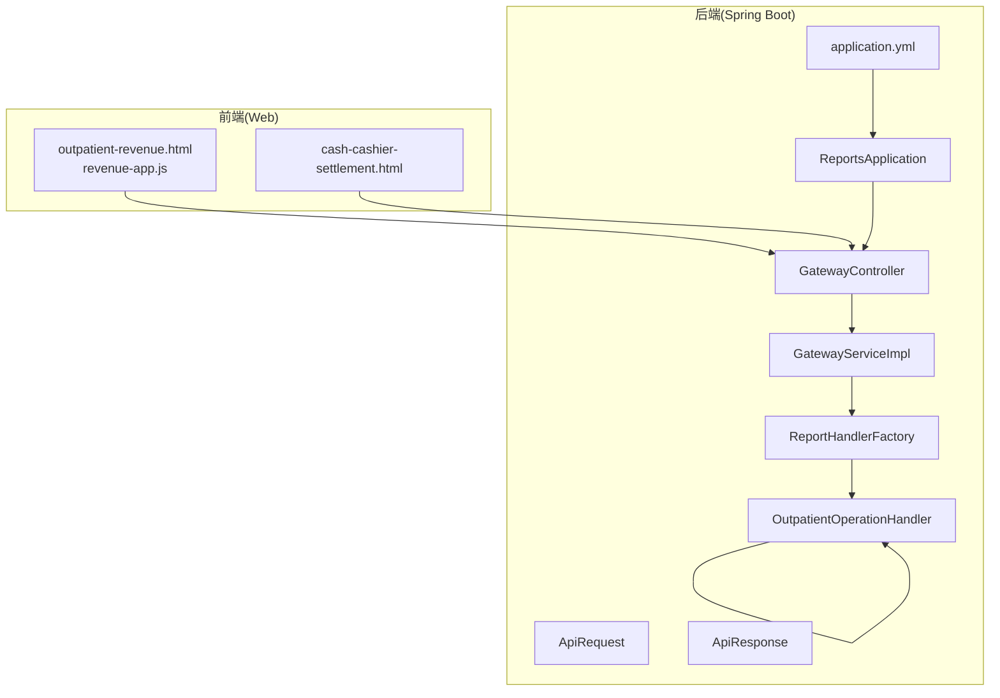
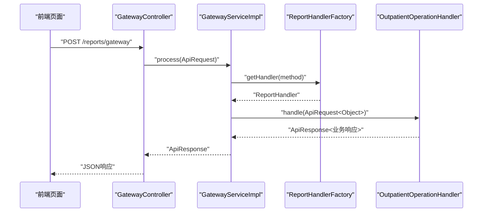
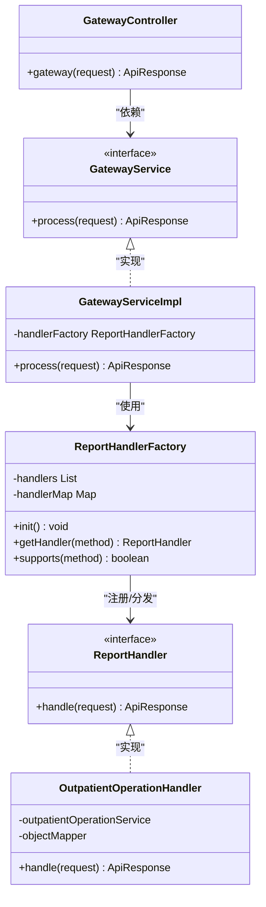
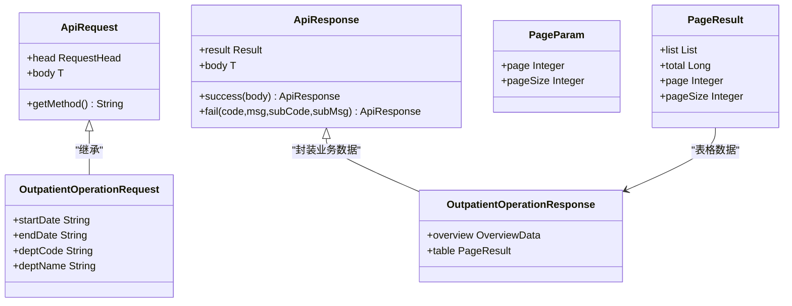
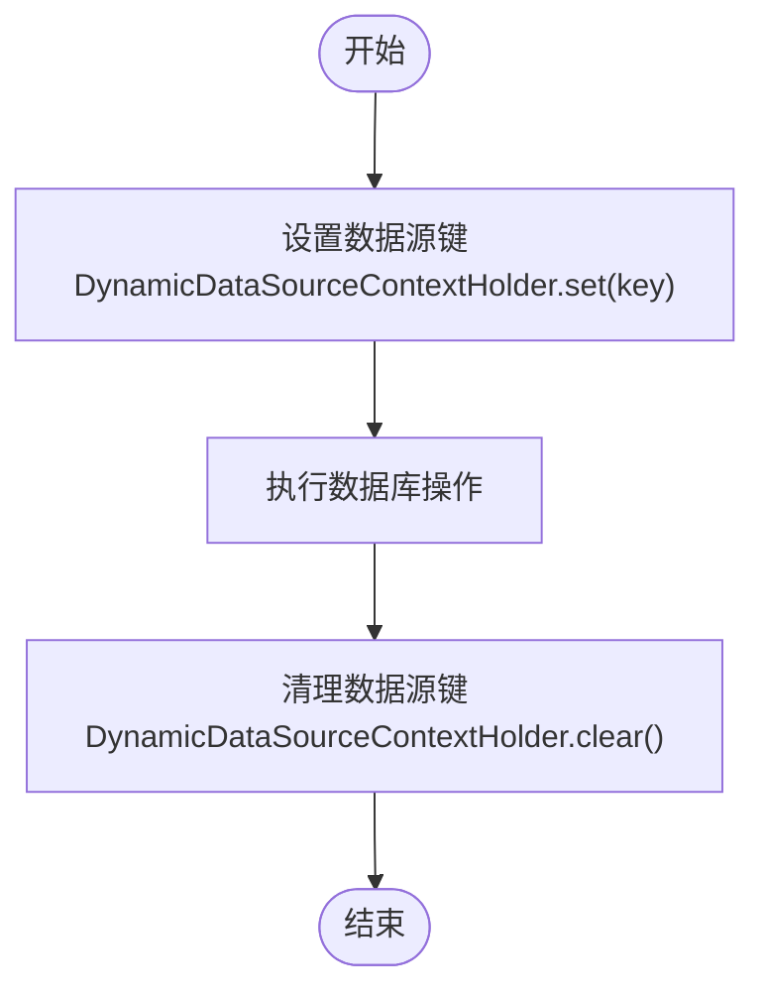
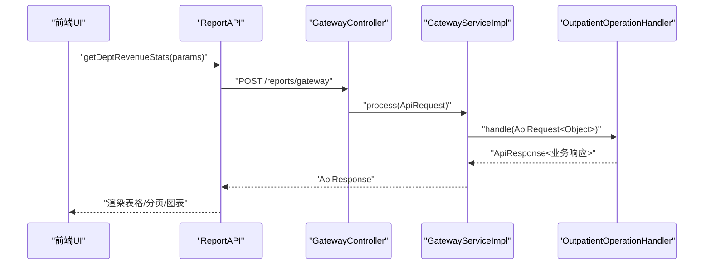
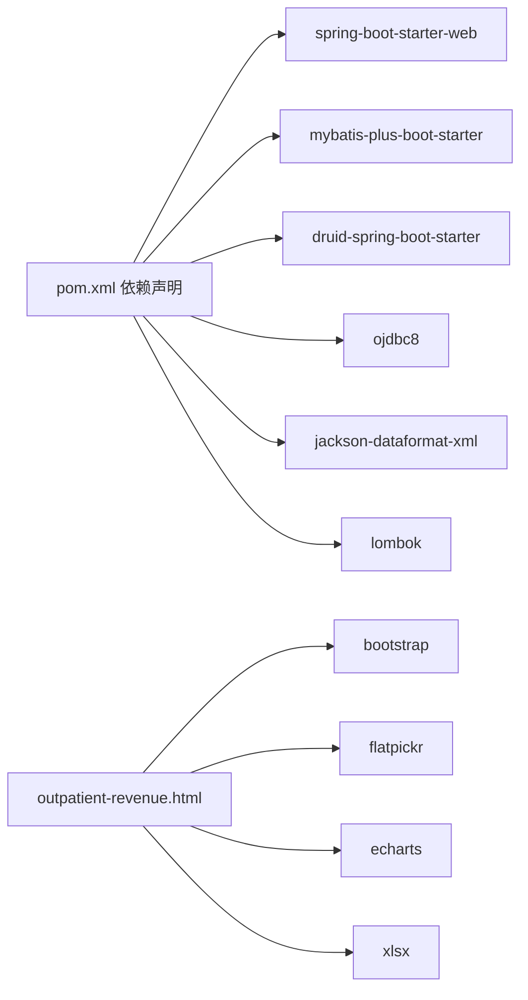

# 项目概述

<cite>
**本文引用的文件**
- [ReportsApplication.java](file://src/main/java/com/reports/ReportsApplication.java)
- [GatewayController.java](file://src/main/java/com/reports/controller/GatewayController.java)
- [GatewayService.java](file://src/main/java/com/reports/service/GatewayService.java)
- [GatewayServiceImpl.java](file://src/main/java/com/reports/service/impl/GatewayServiceImpl.java)
- [ReportHandler.java](file://src/main/java/com/reports/service/handler/ReportHandler.java)
- [ReportHandlerFactory.java](file://src/main/java/com/reports/service/handler/ReportHandlerFactory.java)
- [OutpatientOperationHandler.java](file://src/main/java/com/reports/service/handler/impl/OutpatientOperationHandler.java)
- [ApiRequest.java](file://src/main/java/com/reports/dto/common/ApiRequest.java)
- [ApiResponse.java](file://src/main/java/com/reports/dto/common/ApiResponse.java)
- [OutpatientOperationRequest.java](file://src/main/java/com/reports/dto/request/OutpatientOperationRequest.java)
- [OutpatientOperationResponse.java](file://src/main/java/com/reports/dto/response/OutpatientOperationResponse.java)
- [DynamicDataSource.java](file://src/main/java/com/reports/config/DynamicDataSource.java)
- [application.yml](file://src/main/resources/application.yml)
- [pom.xml](file://pom.xml)
- [architecture.md](file://docs/architecture.md)
- [outpatient-revenue.html](file://reports-web/outpatient/outpatient-revenue.html)
- [revenue-app.js](file://reports-web/outpatient/js/revenue-app.js)
- [cash-cashier-settlement.html](file://reports-web/cash/cash-cashier-settlement.html)
</cite>

## 目录
1. [引言](#引言)
2. [项目结构](#项目结构)
3. [核心组件](#核心组件)
4. [架构总览](#架构总览)
5. [详细组件分析](#详细组件分析)
6. [依赖关系分析](#依赖关系分析)
7. [性能考虑](#性能考虑)
8. [故障排查指南](#故障排查指南)
9. [结论](#结论)
10. [附录](#附录)

## 引言
报告网关系统是一个面向医疗机构的统一报表数据访问平台，旨在提供统一的RESTful网关入口，屏蔽底层多数据源差异，支撑门诊统计、收费报表、数据可视化等场景。系统通过“方法名路由 + 处理器工厂”的扩展机制，实现报表能力的快速新增；通过链路追踪、统一分页与异常处理，保障线上稳定性与可观测性。

## 项目结构
系统采用前后端分离架构：
- 后端：基于Spring Boot的微服务形态，提供统一网关与报表处理器；
- 前端：静态Web页面，内置Bootstrap、Flatpickr、ECharts、SheetJS等组件，实现筛选、分页、图表与导出功能。

图示来源
- [ReportsApplication.java:11-16](file://src/main/java/com/reports/ReportsApplication.java#L11-L16)
- [GatewayController.java:18-35](file://src/main/java/com/reports/controller/GatewayController.java#L18-L35)
- [GatewayServiceImpl.java:20-48](file://src/main/java/com/reports/service/impl/GatewayServiceImpl.java#L20-L48)
- [ReportHandlerFactory.java:21-73](file://src/main/java/com/reports/service/handler/ReportHandlerFactory.java#L21-L73)
- [OutpatientOperationHandler.java:21-64](file://src/main/java/com/reports/service/handler/impl/OutpatientOperationHandler.java#L21-L64)
- [ApiRequest.java:13-34](file://src/main/java/com/reports/dto/common/ApiRequest.java#L13-L34)
- [ApiResponse.java:13-56](file://src/main/java/com/reports/dto/common/ApiResponse.java#L13-L56)
- [application.yml:1-32](file://src/main/resources/application.yml#L1-L32)

章节来源
- [architecture.md:21-82](file://docs/architecture.md#L21-L82)
- [pom.xml:1-110](file://pom.xml#L1-L110)

## 核心组件
- 统一网关入口：接收统一请求，校验method并路由到对应处理器。
- 处理器工厂：自动扫描并注册所有报表处理器，按method分发。
- 报表处理器：实现具体业务逻辑，封装概览与分页数据。
- DTO与分页：统一请求/响应包装、分页参数与结果。
- 多数据源动态切换：通过上下文切换不同数据源。
- 链路追踪：全局日志与追踪号贯穿请求生命周期。

章节来源
- [GatewayController.java:18-35](file://src/main/java/com/reports/controller/GatewayController.java#L18-L35)
- [GatewayService.java:9-16](file://src/main/java/com/reports/service/GatewayService.java#L9-L16)
- [GatewayServiceImpl.java:20-48](file://src/main/java/com/reports/service/impl/GatewayServiceImpl.java#L20-L48)
- [ReportHandlerFactory.java:21-73](file://src/main/java/com/reports/service/handler/ReportHandlerFactory.java#L21-L73)
- [ReportHandler.java:19-27](file://src/main/java/com/reports/service/handler/ReportHandler.java#L19-L27)
- [OutpatientOperationHandler.java:21-64](file://src/main/java/com/reports/service/handler/impl/OutpatientOperationHandler.java#L21-L64)
- [ApiRequest.java:13-34](file://src/main/java/com/reports/dto/common/ApiRequest.java#L13-L34)
- [ApiResponse.java:13-56](file://src/main/java/com/reports/dto/common/ApiResponse.java#L13-L56)
- [DynamicDataSource.java:8-15](file://src/main/java/com/reports/config/DynamicDataSource.java#L8-L15)

## 架构总览
系统采用“单点网关 + 多报表处理器 + 多数据源”的分层设计：
- 控制层：统一入口，负责请求接收与响应封装；
- 业务层：网关服务负责路由与异常处理；
- 处理层：工厂注册与按method分发，处理器执行业务；
- 数据层：动态数据源切换，支持mock/jdbc/mybatis-plus三种模式；
- 观测层：AOP日志切面、追踪号生成、全局异常处理。

图示来源
- [GatewayController.java:31-35](file://src/main/java/com/reports/controller/GatewayController.java#L31-L35)
- [GatewayServiceImpl.java:31-47](file://src/main/java/com/reports/service/impl/GatewayServiceImpl.java#L31-L47)
- [ReportHandlerFactory.java:58-64](file://src/main/java/com/reports/service/handler/ReportHandlerFactory.java#L58-L64)
- [OutpatientOperationHandler.java:34-61](file://src/main/java/com/reports/service/handler/impl/OutpatientOperationHandler.java#L34-L61)

## 详细组件分析

### 统一网关与路由分发
- 网关控制器接收统一请求，调用网关服务处理；
- 网关服务解析method，交由工厂查找处理器；
- 工厂基于注解注册，保证method唯一性与可发现性；
- 处理器负责将泛型body转换为具体请求类型并执行业务。

图示来源
- [GatewayController.java:18-35](file://src/main/java/com/reports/controller/GatewayController.java#L18-L35)
- [GatewayService.java:9-16](file://src/main/java/com/reports/service/GatewayService.java#L9-L16)
- [GatewayServiceImpl.java:20-48](file://src/main/java/com/reports/service/impl/GatewayServiceImpl.java#L20-L48)
- [ReportHandlerFactory.java:21-73](file://src/main/java/com/reports/service/handler/ReportHandlerFactory.java#L21-L73)
- [ReportHandler.java:19-27](file://src/main/java/com/reports/service/handler/ReportHandler.java#L19-L27)
- [OutpatientOperationHandler.java:21-64](file://src/main/java/com/reports/service/handler/impl/OutpatientOperationHandler.java#L21-L64)

章节来源
- [GatewayController.java:18-35](file://src/main/java/com/reports/controller/GatewayController.java#L18-L35)
- [GatewayServiceImpl.java:29-48](file://src/main/java/com/reports/service/impl/GatewayServiceImpl.java#L29-L48)
- [ReportHandlerFactory.java:31-52](file://src/main/java/com/reports/service/handler/ReportHandlerFactory.java#L31-L52)
- [OutpatientOperationHandler.java:34-61](file://src/main/java/com/reports/service/handler/impl/OutpatientOperationHandler.java#L34-L61)

### 数据模型与分页策略
- 统一请求/响应包装，便于跨模块复用；
- 分页参数默认第1页、每页10条，支持PageResult封装；
- 业务处理器组装概览数据与分页表格数据。

图示来源
- [ApiRequest.java:13-34](file://src/main/java/com/reports/dto/common/ApiRequest.java#L13-L34)
- [ApiResponse.java:13-56](file://src/main/java/com/reports/dto/common/ApiResponse.java#L13-L56)
- [OutpatientOperationRequest.java:12-36](file://src/main/java/com/reports/dto/request/OutpatientOperationRequest.java#L12-L36)
- [OutpatientOperationResponse.java:10-24](file://src/main/java/com/reports/dto/response/OutpatientOperationResponse.java#L10-L24)

章节来源
- [ApiRequest.java:13-34](file://src/main/java/com/reports/dto/common/ApiRequest.java#L13-L34)
- [ApiResponse.java:13-56](file://src/main/java/com/reports/dto/common/ApiResponse.java#L13-L56)
- [OutpatientOperationRequest.java:12-36](file://src/main/java/com/reports/dto/request/OutpatientOperationRequest.java#L12-L36)
- [OutpatientOperationResponse.java:10-24](file://src/main/java/com/reports/dto/response/OutpatientOperationResponse.java#L10-L24)

### 多数据源动态切换
- 通过继承抽象路由数据源，在线程上下文中保存当前数据源键；
- 在Service层设置数据源键，执行完成后清理，避免污染其他线程；
- 配置文件中可定义多个数据源，按需切换。

图示来源
- [DynamicDataSource.java:10-13](file://src/main/java/com/reports/config/DynamicDataSource.java#L10-L13)

章节来源
- [DynamicDataSource.java:8-15](file://src/main/java/com/reports/config/DynamicDataSource.java#L8-L15)

### 前端功能与交互流程
- 门诊收入分析页面：支持时间范围、科室筛选、分页、排序与导出；
- 收费员结账统计页面：支持标签切换、按日/按月维度、图表展示与导出；
- 前端通过API模块向网关发起请求，渲染概览与表格数据。

图示来源
- [outpatient-revenue.html:180-198](file://reports-web/outpatient/outpatient-revenue.html#L180-L198)
- [revenue-app.js:179-219](file://reports-web/outpatient/js/revenue-app.js#L179-L219)
- [GatewayController.java:31-35](file://src/main/java/com/reports/controller/GatewayController.java#L31-L35)
- [GatewayServiceImpl.java:31-47](file://src/main/java/com/reports/service/impl/GatewayServiceImpl.java#L31-L47)
- [OutpatientOperationHandler.java:34-61](file://src/main/java/com/reports/service/handler/impl/OutpatientOperationHandler.java#L34-L61)

章节来源
- [outpatient-revenue.html:1-164](file://reports-web/outpatient/outpatient-revenue.html#L1-L164)
- [revenue-app.js:1-516](file://reports-web/outpatient/js/revenue-app.js#L1-L516)
- [cash-cashier-settlement.html:1-101](file://reports-web/cash/cash-cashier-settlement.html#L1-L101)

## 依赖关系分析
- 后端依赖Spring Boot Web、MyBatis-Plus、Druid连接池、Oracle JDBC、Jackson XML、Lombok等；
- 前端依赖Bootstrap、Flatpickr、ECharts、SheetJS等，用于界面样式、日期选择、图表与导出。

图示来源
- [pom.xml:26-98](file://pom.xml#L26-L98)
- [outpatient-revenue.html:7-161](file://reports-web/outpatient/outpatient-revenue.html#L7-L161)

章节来源
- [pom.xml:1-110](file://pom.xml#L1-L110)

## 性能考虑
- 数据模式可配置：mock/jdbc/mybatis-plus，便于开发调试与生产切换；
- 多数据源切换需谨慎控制上下文清理，避免线程污染；
- 建议对热点报表增加缓存、接入SQL监控面板、限制并发与限流；
- 前端分页与排序在客户端完成，建议结合后端分页参数优化大数据量场景。

## 故障排查指南
- method缺失或不正确：检查请求头method字段，确保与处理器注册一致；
- 处理器未注册：确认实现类上MethodMapping注解value非空且唯一；
- 数据源异常：核对数据源配置与上下文切换逻辑；
- 日志追踪：通过追踪号定位请求链路，结合全局异常处理器定位问题。

章节来源
- [GatewayServiceImpl.java:32-44](file://src/main/java/com/reports/service/impl/GatewayServiceImpl.java#L32-L44)
- [ReportHandlerFactory.java:35-51](file://src/main/java/com/reports/service/handler/ReportHandlerFactory.java#L35-L51)
- [application.yml:12-31](file://src/main/resources/application.yml#L12-L31)

## 结论
报告网关系统以“统一网关 + 处理器工厂 + 多数据源”为核心，实现了医疗机构报表能力的快速扩展与稳定交付。前后端分离的设计提升了开发效率与用户体验，配合链路追踪与统一封装的DTO，保障了系统的可观测性与可维护性。建议在生产环境中进一步完善鉴权、限流、缓存与监控能力，持续提升系统性能与可靠性。

## 附录

### 快速开始
- 环境要求
  - JDK 1.8
  - Maven
- 启动应用
  - 使用Maven命令启动Spring Boot应用
- 访问网关
  - POST请求至统一网关入口，携带method与业务参数
- 前端页面
  - 通过浏览器打开静态HTML页面，选择报表模块进行体验

章节来源
- [application.yml:1-11](file://src/main/resources/application.yml#L1-L11)
- [architecture.md:420-447](file://docs/architecture.md#L420-L447)
- [outpatient-revenue.html:1-164](file://reports-web/outpatient/outpatient-revenue.html#L1-L164)